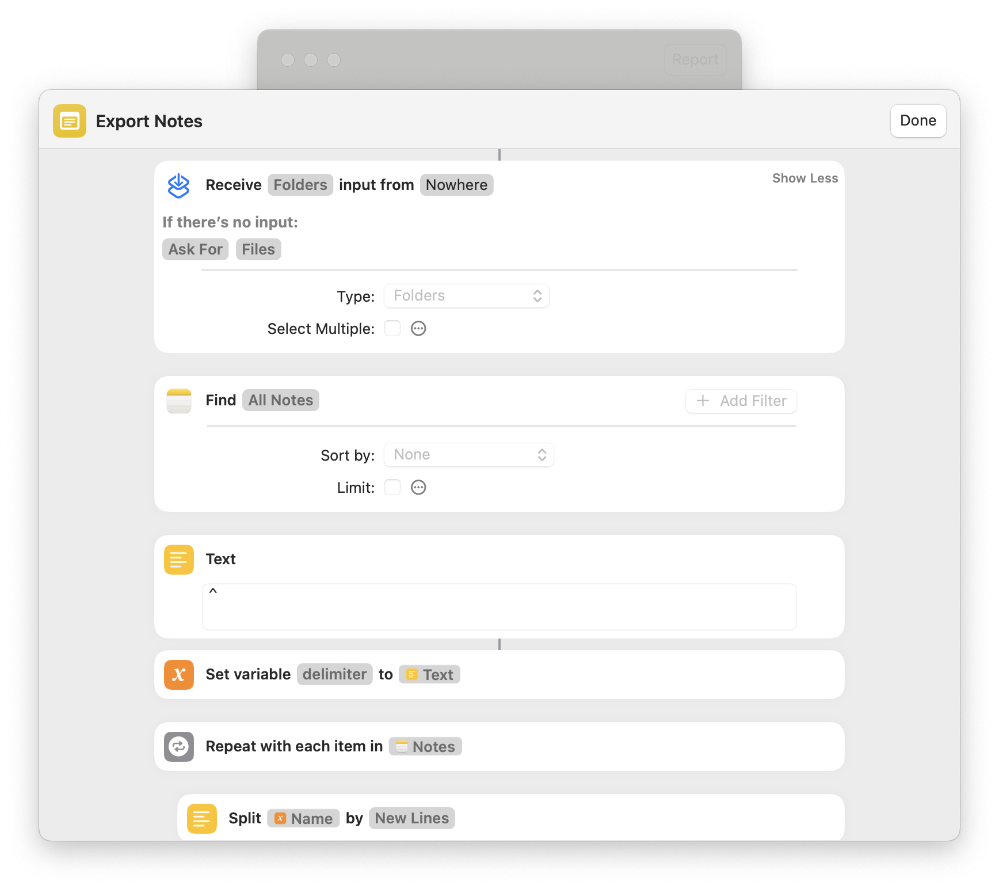

# Apple Notes Exporter

Export Apple Notes to HTML and Markdown on macOS, using `Shortcuts.app` and a bit~~e~~ of Python

1. Clone repository (Terminal)

```shell
git clone https://github.com/Kylmakalle/apple-notes-exporter
cd notes-exporter
```

2. Install `Export Notes` Shortcut using [Link](https://www.icloud.com/shortcuts/352f1880188240bca4259977f3f17357) or `open "Export Notes.shortcut"` file
3. `Shortucts.app` > Settings > Advanced > Allow Sharing Large Amounts of Data
4. Run `make`
   1. `Shortcuts.app` will ask for your approval to save notes and images. Click **Allow**.
   2. If you miss-clicked or something does not work, Go to `Export Notes` Shortcut > **(i)** Shotcut details > Privacy > Reset Privacy and Try again.
5. Done! You can find files at [notes](./notes) directory

## Caveats

1. Only Image attachements  are supported. Drawings do not export for some reason.
2. Protected notes are not supported. They will only have a title.
3. Markdown exports via _Make Markdown from Rich Text_ Shortcut action "comparable to Aaron Swartz's [html2text](https://github.com/aaronsw/html2text) script" as Apple says. Looks like it's done with [textutil](https://keith.github.io/xcode-man-pages/textutil.1.html). The converter doesn't work well with headings, tables and much more, that's why HTML sources are also present. Source RTF will lack of any attachment references for some reason.
    > Not sure why Apple decided to set html2text as their quality bar. Perhaps, there're much more modern converters.
4. Notes with long titles may exceed file path limit.

## macOS Shortcut source

Probably, you're here because you don't want to lose your data due to various reasons. Me too. I don't trust `.shortcuts` format much, that's why you can find visual source of `Export Notes.shortcut` in [shortcut-source](./shortcut-source).



## Tricks

While Implementing this shortcut, I've tried various actions, below I'll share some of the insights I got that might me helpful to any Shortcut creator.

1. `Export Notes.shortcut` creates files in format `$creation_date^$escaped_folder_name^$escaped_note_name[^$attachment_name]` and then I use Python to re-create folder structure. The need for post-processign is simple, otherwise `Shortcuts.app` will ask your Write approval for each created folder (even if it was created within the shortcut). That means you'll need to click Allow for each note you have. This may be hundreeds or thousands.
    > Creation date is required to distingush different notes with the same title.
2. `Shortcuts.app` does file changes in a temporary directory `~/Library/Group Containers/group.is.workflow.shortcuts/Temporary/com.apple.WorkflowKit.BackgroundShortcutRunner`. For some reason, `Rename` or `Move` File actions caused errors like `couldn't be moved to "com.apple.WorkflowKit.BackgroundShortcutRunner" because an item with the same name already exists.`. Instead,
3. When providing Subpath to `Save File` action, only top-level Subpath will work. e.g. "Save `HTML` to `PATH`, Subpath: `notes/backup/latest`" will not work. Just `notes` will.
4. Apple exports Note's HTMLs with `file:///` references to attachements. This doesn't work for both HTML and Markdown previews for some reason. Simple python script replaces these occurances to source local directory.

## Alternative Approaches

While I think exporting via `Shortcuts.app` is more or-less official and _should_ less likely to break in the future, here's what I've found:

- [Exporter](https://apps.apple.com/app/id1099120373) macOS app with similar to `Shortcuts.app` capabilities
- [Automate Copy-Pasting](https://github.com/KrauseFx/notes-exporter?tab=readme-ov-file#keyboard-maestro-based-exporter)
- [Access internal Database](https://github.com/KrauseFx/notes-exporter?tab=readme-ov-file#deprecated-database-exporter)
